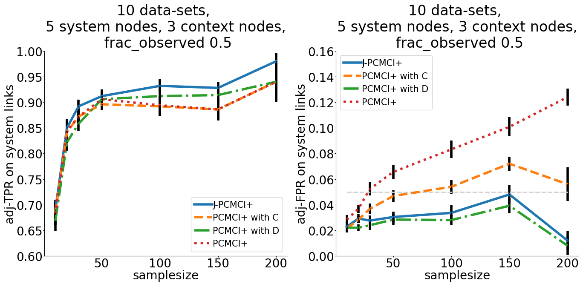
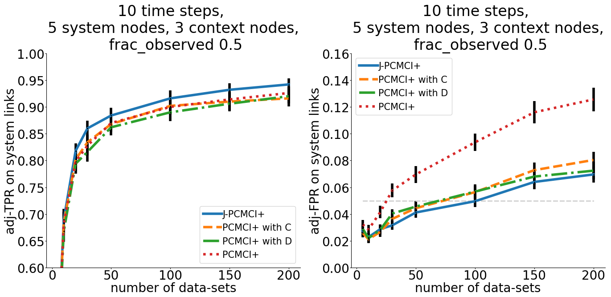
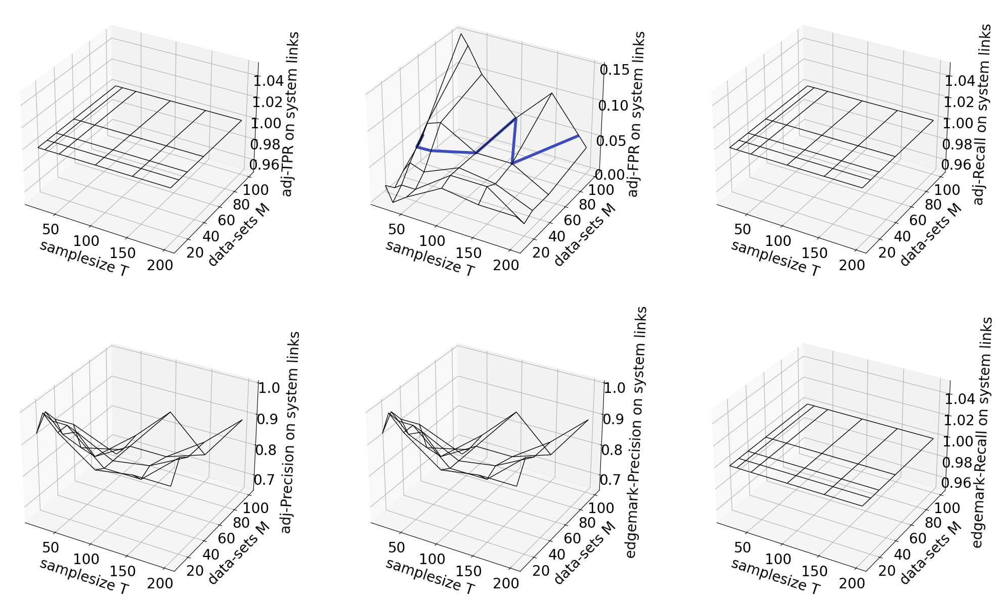
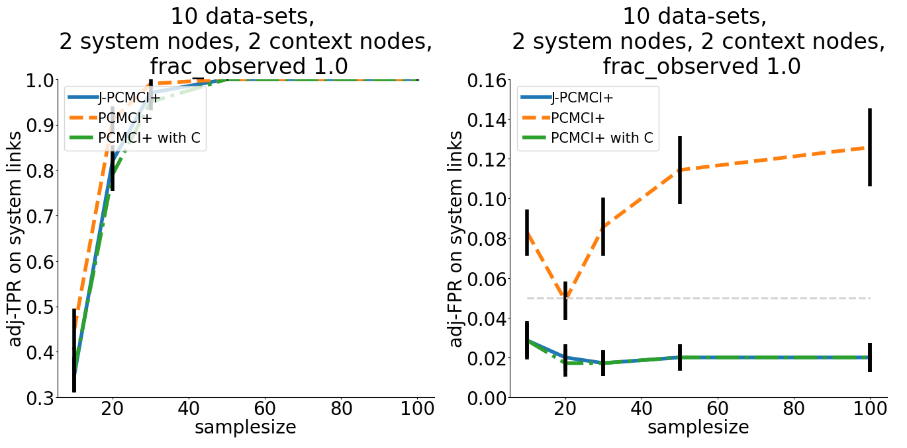
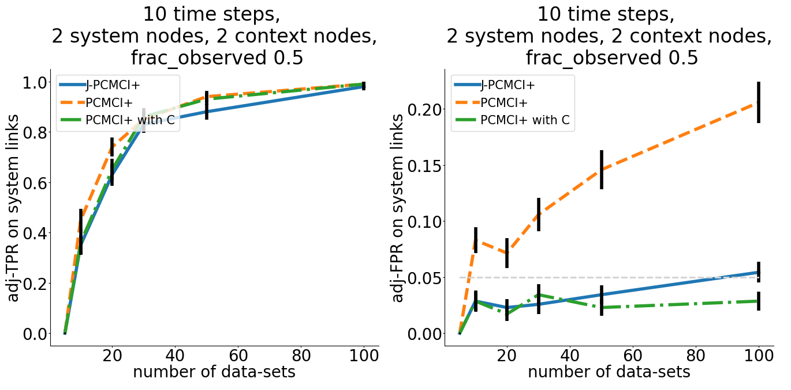

# Causal Discovery for time series from multiple datasets with latent contexts

This repository is the official implementation to reproduce the experiments described in "Causal Discovery for time 
series from multiple datasets with latent contexts" by W. Günther, U. Ninad, and J. Runge (accepted at UAI 2023). 

## Requirements

To install the requirements run:

```setup
pip install -r requirements.txt
```

## Running the presented Experiments

In this section, we describe how to run the whole experimental pipeline (data generation, method evaluation, 
metric calculation, plotting) to generate the results and plots presented in the paper.

In the config.py file you can specify the paths in which the output of these experiments should be stored.

To run the main experiments, execute this command:
```whole pipeline
python run_experiments.py --experiment 0
```

This generates toy-data from the SCM 
```math
X^{i,m}_t = a_i X^{i,m}_{t-1} + \sum_{j} b_j X^{j,m}_{t-\tau_j} + 
\sum_{j} c_jC^{\text{time},j}_{t-\tau_j} + \sum_{j} d_jC^{j, m}_\text{space} + \eta^{i,m}_t,
```
where $i \in \mathcal{I}$, $t= 1, \ldots, T$, and $m=1, \ldots, M$, $C^{\text{time},k} \sim \mathcal{N}(0,1)$, 
$C^{\text{space}} \sim \mathcal{N}(0,1)$. Furthermore, $\eta^i \sim \mathcal{N}(0,1)$ i.i.d., 
$a_i$ autocorrelation parameter uniformly drawn from $[0.3, 0.8]$, coefficients $b_j,c_j, d_j$ are uniformly drawn 
from $[0.5, 0.9]$, $50\%$ of the links are contemporaneous, the remaining lags are drawn uniformly from $[1,3]$.
See the paper for further details.

It then computes the output of the J-PCMCI+, PCMCI+ with observed context variables, PCMCI+ with dummy variables and
original PCMCI+ on system variables.

Using the ground truth graphs and output graphs of these methods, it calculates the metrics which are described in
more detail in the paper, and plots the results.

The results are as follows:




To run a simpler (and quicker) linear version of the experiments, run this command:
```whole pipeline
python run_experiments.py --experiment 1
```

This generates toy-data from a simplified version of the SCM above, namely from
```math
\begin{split}
    X^0_t &:=  0.5X^1_{t}+0.5C_\text{space}^0 + 0.5C_\text{space}^1 +0.5C_{\text{time}, t-1}^0 + 0.5C_{\text{time}, t-1}^1+ \eta^0\\
    X^1_t &:= 0.5X^1_{t-1}+ 0.5C_\text{space}^0 + 0.5C_\text{space}^1 +0.5C_{\text{time}, t-1}^0 +0.5C_{\text{time}, t-1}^1 + \eta^1\\
    C_\text{space}^0 &:= \eta^0_\text{space}\\
    C_\text{space}^1 &:= \eta^1_\text{space}\\
    C_{\text{time},t}^0 &:= \eta^0_\text{time}\\
    C_{\text{time},t}^1 &:= \eta^1_\text{time}
\end{split}
```
And then proceeds as described above.

The results of this experimental setup are


To run a nonlinear variant of the simplified experiments, run this command:
```whole pipeline
python run_experiments.py --experiment 2
```

This generates toy-data from the following SCM
```math
        \begin{split}
            X^0_t &:=  0.5(X^1_{t})^2+0.5C_\text{space}^0 + 0.5C_\text{space}^1 +0.5C_{\text{time}, t-1}^0 + 0.5C_{\text{time}, t-1}^1+ \eta^0\\
            X^1_t &:= 0.5X^1_{t-1}+ 0.5C_\text{space}^0 + 0.5C_\text{space}^1 +0.5C_{\text{time}, t-1}^0 +0.5C_{\text{time}, t-1}^1 + \eta^1\\
            C_\text{space}^0 &:= \eta^0_\text{space}\\
            C_\text{space}^1 &:= \eta^1_\text{space}\\
            C_{\text{time},t}^0 &:= \eta^0_\text{time}\\
            C_{\text{time},t}^1 &:= \eta^1_\text{time}
        \end{split}
```
And then proceeds as described above.
The results of this experimental setup are



## Generating Data and Evaluating the Algorithm

You can also only generate data for specific parameter settings and compare the algorithms on these. 
This is done by running this command:
```data
python compute.py --experiment 1
```

Using the parameters you can specify:
 - `c` float, dependence factor between $X$ and $Y$
 - `affected_vars` list[str], list of the affected nodes, default is `['x', 'y']`
 - `hs_types` list[str], functional form and dependence of heteroskedasticity, either `'linear_z'`, `'periodic_z'`, or `'quadratic_z'` or `'linear_time'`, `'periodic_time'`, or `'quadratic_time'` , default is `['linear_time']`
 - `strength` float, the strength of heteroskedasticity, default is `5.`
 - `sample_size` int, sample size
 - `random_seed` int or None, random seed to be used for the experiment

-e <experiment> -ss <sample_size> -d <nb_domains> -n <nb_nodes> -l <nb_links> -kt <k_time> " \
               "-ks <k_space> -o <frac_observed> -f <functional_form> -t <ci_test> -a <pc_alpha> -tm <tau_max> " \
               "-nr <nb_realisations>


## Calculating the Metrics

To calculate the metrics on pre-computed outputs of the methods, run:

```metrics
python methods.py --experiment 0
```

Using the parameters you can specify:
 - `experiment` {0, 1, 2}, experiment type

## Plotting

```metrics
python plot.py --experiment 0
```

Again, using the parameters you can specify:
 - `experiment` {0, 1, 2}, experiment type


## License

You can redistribute and/or modify the code under the terms of the GNU General Public License as published by the Free Software Foundation; either version 3 of the License, or (at your option) any later version.
